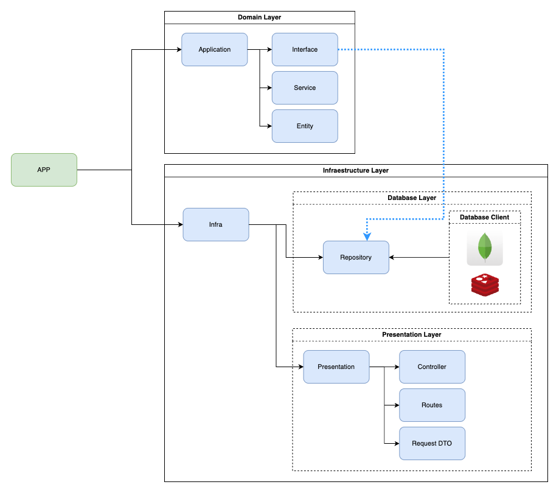
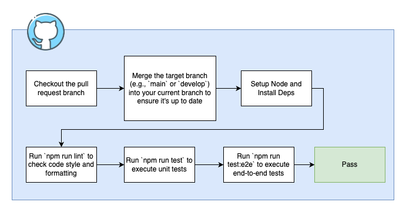

## Backend Architecture and Implementation Notes

### Overview

> [!NOTE]
> Many questions that would be relevant were not clarified in the [questions](#Questions) challenge, but we will build the application with a focus on scale, performance and good architectural practices! With that, we will follow some premises.

- Payload of `POST /data` is a not structured JSON, but has every contains `id`, `timestamp`, e `payload` (where payload is any object)

- Requests are fully synchronous, and the response is sent only after data is successfully committed to the database

- A response time of 500ms is considered average for the backend (excluding client connection time)

- Reader is directly with transaction ID returning with database

---

### Technical decisions and trade-offs

| Component         | Technology                 | Trade-off / Justification                                                                                                               |
| ----------------- | -------------------------- | --------------------------------------------------------------------------------------------------------------------------------------- |
| Application       | NodeJS (TypeScript)        | Fast productivity. But because it is single-threaded, it requires attention to I/O                                                      |
| HTTP Server       | Express                    | Simple and extensible                                                                                                                   |
| Schema Validation | Zod                        | Type-safe and concise, May not scale well to complex schemas, but serves the scope well                                                 |
| Database          | MongoDB + ReplicaSet (K8s) | Great for unstructured data. Not as efficient for heavy queries! (But architecture of application accept other databases in the future) |
| ODM               | Mongoose                   | Facilitates modeling and validation. May add overhead in high-throughput scenarios                                                      |

---

### Application Structure

Stack: NodeJS / Typescript

The application has two main layers, domain and infrastructure, to ensure consistency and extensiveness in the future.

- **HTTP Server**: Using [express](https://expressjs.com/) because it is a simple http server with multiple resources native.
- **Validation**: Using [zod](https://zod.dev/) to validate schemas.
- **MongoDB Driver**: Using [mongoose](https://mongoosejs.com/) for connect in database, this is a mature libary for this action.

Below is the folder structure app

```text
app/
│── application/
│   ├── interface/
│   │   └── repository/
│   └── service/
│── infra/
│   ├── presentation/
│   │   ├── controller/
│   │   ├── dtos/
│   │   └── routes/
│   └── repository/
│       ├── mongodb/
│       └── (...other-databases)/
└── main.ts
```



---

### Setup

#### Developer Mode

1. Create your .env is very important
2. Set node version to 22 or later
3. `npm install`
4. `npm run build`

---

### Tests

- The project is using eslint to maintain design standard
- For unit tests we are using [jest](https://jestjs.io/)
- For tests e2e we are using [supertest](https://www.npmjs.com/package/supertest)
- All tests is included in folders `__test__` inside app
- Acceptable coverage greater than 75%

How to test.

1. `npm run test`
2. `npm run test:e2e`

Test Lint
1. `npm run lint`

---

### CI/CD

When opening a pull request, run the trigger that executes the steps.

1. Checkout the pull request branch

2. Merge the target branch (`main` or `develop`) into your current branch to ensure it's up to date

3. Setup Node and Install Deps

4. Run `npm run lint` to check code style and formatting

5. Run `npm run test` to execute unit tests

6. Run `npm run test:e2e` to execute end-to-end tests

7. Submit the PR for review and wait for approval from at least one other collaborator before merging



---

### Deploy K8S

[Readme](./k8s/README.md)

---

### Undefined Questions About Project

- The JSON data format and structure were not defined, nor were mandatory fields defined.

- The 500ms response time is measured on the client or server side.

- It was not defined whether the application response should be synchronous or not.

- The expected event volumes were not defined, whether they will be 1 million simultaneous requests or peaks of these volumes.

- It was not defined whether we have the possibility of having multi-tenant (which would scale the database in a much simpler way).

- It was not defined whether the saved data persists forever or has a lifetime, which would optimize the database if after a while we can remove it.